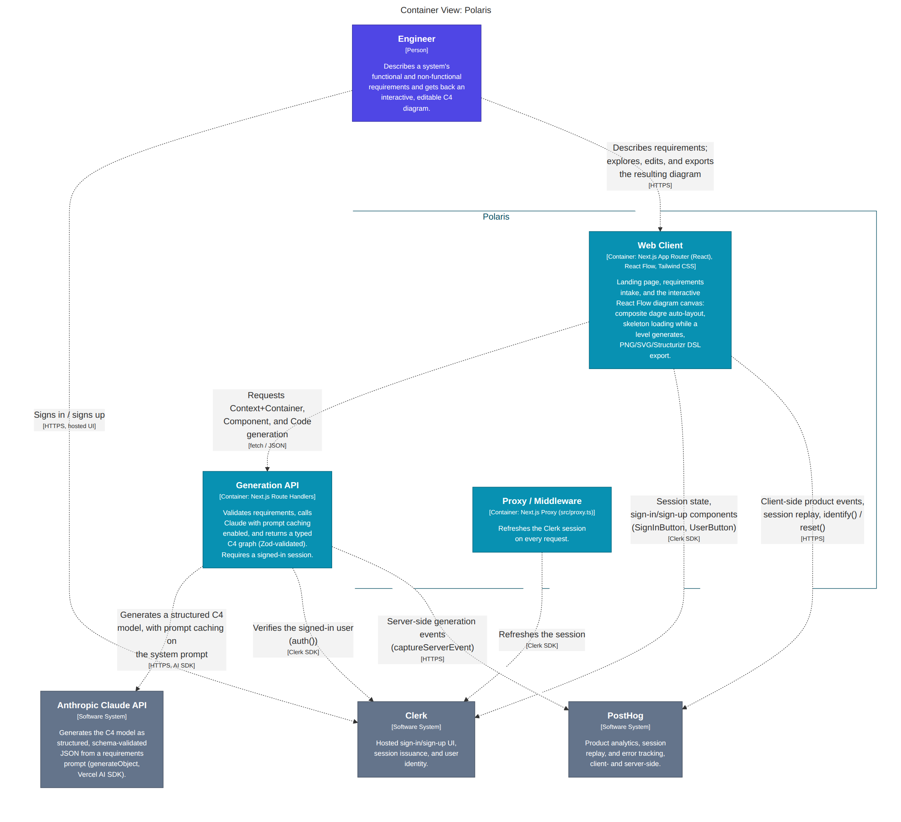

# Polaris

Turn a system's functional and non-functional requirements into an
interactive, navigable C4 architecture diagram — Context, Container,
Component, and Code, all nested on one canvas — with every element carrying
the *rationale* for why it's there, tied back to the requirement that drove
it.

Generating a diagram requires a free account; browsing the landing page does
not. Saved projects and a persistence layer aren't built yet — see the
project PRD for the full history and decisions.

## Stack

- Next.js 16 (App Router, Turbopack) + TypeScript + Tailwind
- [Vercel AI SDK](https://ai-sdk.dev) + `@ai-sdk/anthropic`, using
  `generateObject` so the model returns a typed C4 graph (Zod schema), not
  prose to parse — with Anthropic prompt caching on each route's system
  prompt
- [React Flow](https://reactflow.dev) for the interactive canvas — the whole
  model renders as one nested composite diagram (dagre compound-graph
  auto-layout: expanding a container/component draws it as a boundary box
  containing its children, dashed-boundary within dashed-boundary), with a
  pulsing skeleton placeholder while a level is still generating
- `html-to-image` for PNG/SVG export; a Structurizr DSL exporter for
  architecture-as-code
- **Auth:** [Clerk](https://clerk.com) — hosted `/sign-in` and `/sign-up`,
  gating architecture generation (not the landing page itself)
- **Analytics:** [PostHog](https://posthog.com) (free tier) — product
  events, session replay, and error tracking, both client-side
  (`instrumentation-client.ts`) and server-side (`src/lib/posthog-server.ts`
  from the generation routes)

## Getting started

```bash
npm install
cp .env.example .env.local
# fill in .env.local — see below for what's required
npm run dev
```

Open http://localhost:3000 (Next.js bumps to 3001, 3002, etc. if something
else is already on 3000 — check your terminal's output for the actual port).

### Required: Anthropic API key

You'll need an `ANTHROPIC_API_KEY` from
https://console.anthropic.com/settings/keys. The model is set in
`src/lib/anthropic.ts` (`MODEL_ID`, overridable via `ANTHROPIC_MODEL`) —
check https://docs.claude.com for current model IDs if the default has aged
out.

### Required: Clerk (auth)

Generating an architecture requires signing in — `/api/generate*` check the
session server-side and return 401 if you're not signed in, and the
"Enter the engine" / "Generate your architecture" buttons open Clerk's
sign-in modal for signed-out visitors instead of proceeding. See
`.env.example` for the exact variables (from your Clerk dashboard's API Keys
page) and their defaults.

### Required for local dev, optional in production: PostHog

`instrumentation-client.ts` and `src/lib/posthog-server.ts` both throw on
`npm run dev` if `NEXT_PUBLIC_POSTHOG_KEY`/`NEXT_PUBLIC_POSTHOG_HOST` are
unset, as a deliberate reminder to configure them — in production
(`NODE_ENV=production`) they're skipped silently instead. Free tier, no card
— see `.env.example`.

## How it works

- `src/lib/c4-schema.ts` — Zod schemas for the requirements input and every
  level of the generated C4 model (nodes: person / softwareSystem /
  externalSystem / container / datastore / component / class).
- `src/lib/prompt.ts` — the three system prompts (Context+Container,
  Component, Code) that ground every architectural choice in a stated
  requirement, and the functions that build each level's user prompt.
- `src/app/api/generate*/route.ts` — route handlers that require a signed-in
  user, validate input, call `generateObject` with prompt caching enabled,
  capture a PostHog event on success, and return the model as JSON.
- `src/lib/composite-layout.ts` — the layout engine: a dagre compound graph
  lays out the whole model as nested boundary boxes in one pass (with an
  invisible "anchor" node per boundary to work around a dagre limitation on
  edges terminating at cluster nodes), plus synthetic skeleton placeholder
  nodes while a container/component's children are still generating.
- `src/components/DiagramCanvas.tsx`, `GroupNode.tsx`, `C4NodeView.tsx`,
  `SkeletonNode.tsx` — the React Flow canvas and its node renderers.
- `src/components/Inspector.tsx` — the side panel for viewing/editing a
  selected node's or edge's fields, and for deleting it.
- `src/proxy.ts` — Clerk's middleware.
- `src/app/page.tsx` — landing → requirements → generation → canvas +
  inspector, and all in-memory model edits (rename/add/delete). Identifies
  the signed-in user to PostHog and fires product events on generate/edit/
  export.

## Architecture



This is Polaris's own C4 model — fittingly, given what the product does —
kept as code rather than a stale drawing:

- `architecture/workspace.dsl` — the source of truth, written in
  [Structurizr DSL](https://docs.structurizr.com/dsl) (the same
  architecture-as-code format `src/lib/structurizr.ts` exports user-generated
  diagrams to). Update this file whenever a container, external dependency,
  or major relationship changes.
- `npm run diagram` (`scripts/render-architecture.mjs`) regenerates
  `architecture/context.png` and `architecture/containers.png` from the DSL —
  downloads and caches Structurizr CLI on first run (~100MB, gitignored),
  validates the DSL, exports it to Mermaid, and renders both views to PNG via
  `@mermaid-js/mermaid-cli`. Requires a JDK on `PATH`.
- Commit the regenerated PNGs alongside your code change so the diagram in
  this README never drifts from the DSL. There's also a System Context view
  at `architecture/context.png`.

## Known limitations (by design, not oversight)

- Manually dragging a node to reposition it is not preserved across edits —
  any add/delete/rename triggers a fresh auto-layout.
- New relationships drawn by dragging between nodes get a generic label
  ("communicates with") — edit it via the Inspector after creating it.
- Targeted regeneration ("just redo this one container") isn't wired up —
  editing is fully manual, or you regenerate a level from scratch.
- Nothing persists between sessions yet — refreshing loses the current
  diagram. No saved projects, no share links.

## Deploying to Vercel

```bash
npm i -g vercel   # if you don't have it
vercel
```

Set every variable from `.env.local` in the Vercel project's Settings →
Environment Variables before your first real deploy (`vercel dev`/`vercel
--prod` won't pick up `.env.local` in production) — at minimum
`ANTHROPIC_API_KEY`, `NEXT_PUBLIC_CLERK_PUBLISHABLE_KEY`, and
`CLERK_SECRET_KEY`. Add PostHog's two variables if you want analytics in
production too (optional there, unlike local dev). Redeploy after adding
anything.

## Suggested next steps

1. Persistence — a saved-projects layer so a diagram survives a refresh and
   you can return to it (was prototyped once against Supabase/Drizzle and
   reverted in favor of Clerk-only auth for now).
2. Share links (read-only) for a saved project.
3. Targeted regeneration of a single node/subgraph instead of full
   regeneration only.
